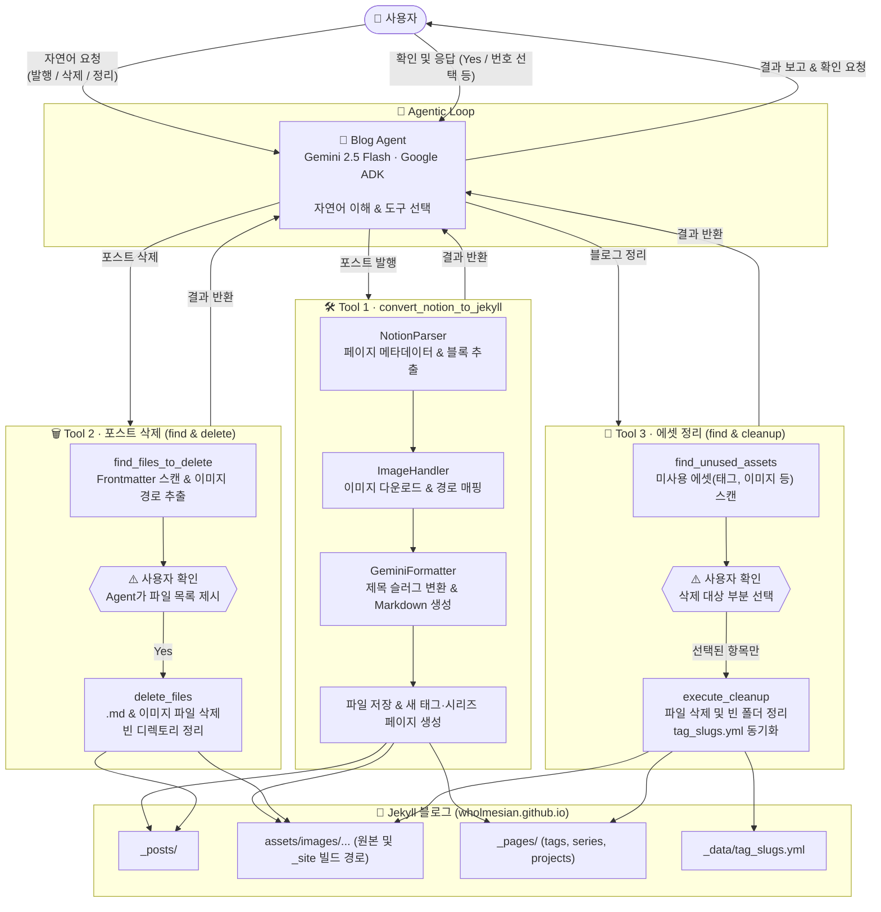

# blog-agent
wholmesian.github.io 관리를 돕는 Agentic AI 도구

## 🛠 구현된 도구 (Implemented Tools)

현재 `blog_manager` 에이전트에는 블로그 관리를 자동화하기 위한 세 가지 핵심 도구가 구현되어 있습니다.

### 1. Notion to Jekyll 변환 도구 (`convert_notion_to_jekyll`)
- **기능**: 사용자가 제공한 Notion 페이지 ID 또는 URL을 기반으로 페이지 내용을 파싱하고, Jekyll 블로그용 Markdown 포스트로 변환합니다.
- **특징**:
  - 노션 본문 블록 및 메타데이터 추출
  - 본문 내 이미지를 다운로드하여 로컬 및 웹루트 경로로 자동 매핑
  - Gemini API를 활용하여 제목을 영어 Slug로 변환 및 프론트매터 자동 생성
  - 포스트에 포함된 새로운 태그(Tag) 및 시리즈(Series) 페이지 자동 생성

### 2. 블로그 포스트 검색 도구 (`find_files_to_delete`)
- **기능**: 삭제하고자 하는 블로그 포스트의 제목(title)을 입력받아, 해당하는 마크다운 파일과 해당 포스트에서 사용된 이미지 파일들을 탐색합니다.
- **특징**:
  - 사용자의 실수로 인한 삭제를 방지하기 위한 2단계 삭제 프로세스의 첫 번째 단계
  - Frontmatter를 분석하여 정확한 포스트를 찾고, 본문 내에서 로컬 이미지 참조를 추출

### 3. 블로그 포스트 삭제 도구 (`delete_files`)
- **기능**: `find_files_to_delete` 도구가 반환한 파일 목록을 실제로 파일 시스템에서 삭제합니다.
- **특징**:
  - 사용자로부터 명시적인 확인(Confirmation)을 받은 후에만 실행
  - 마크다운 파일 및 이미지 파일을 삭제하며, 이미지가 삭제된 후 빈 폴더가 남으면 함께 정리

### 4. 블로그 에셋 정리 도구 (`find_unused_assets` & `execute_cleanup`)
- **기능**: 블로그 내에서 더 이상 참조되지 않는 잉여 에셋(태그, 시리즈, 프로젝트, 이미지)을 스캔하고, 사용자가 선택적으로 삭제할 수 있도록 돕습니다.
- **특징**:
  - `_posts/`의 프론트매터 및 본문을 분석하여 실제 사용 중인 에셋만 추려내어 미사용 파일 식별
  - 사용자에게 미사용 항목을 리스트업하고, 안전하게 삭제 대상을 부분 선택(partial selection) 가능
  - 태그 페이지 파일 삭제 시, `_data/tag_slugs.yml`의 매핑 정보도 자동으로 동기화하여 삭제

<br>

## ⚙️ 시스템 워크플로우 시각화



## 🚀 사용 방법 (How to Use)

Google Agent Development Kit (ADK) CLI를 사용하여 에이전트를 실행할 수 있습니다.

1. `blog-agent` 디렉토리로 이동하여 가상 환경을 활성화합니다.
   ```bash
   source venv/bin/activate
   ```
2. **CLI 환경에서 실행하기**
   `adk run` 명령어를 통해 터미널에서 챗봇 프롬프트를 실행합니다.
   ```bash
   adk run blog_manager/agent.py
   ```

3. **Web UI 환경에서 실행하기**
   ADK에서 제공하는 Web UI 서버를 띄워 브라우저에서 직관적으로 사용할 수 있습니다.
   ```bash
   adk web .
   ```
   *(터미널에 출력되는 `http://localhost:8080` 등의 로컬 주소로 접속하세요)*

4. 실행된 프롬프트 또는 웹 브라우저에서 자연어로 자유롭게 요청합니다.
   - *"이 노션 페이지를 블로그로 만들어줘: [Notion URL]"*
   - *"[포스트 제목] 포스트랑 관련 이미지들 다 지워줄래?"*
   - *"블로그 정리 도구를 실행해서 안 쓰는 태그나 이미지를 지워줘"*
