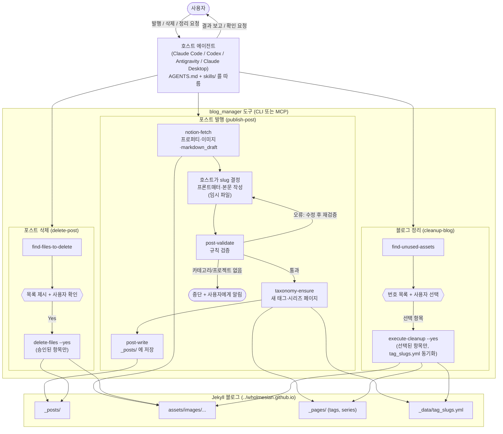

# blog-agent
wholmesian.github.io 관리를 돕는 도구 모음 (Claude Code / Codex / Google Antigravity / Claude Desktop 지원)

## 📌 소개

Notion 페이지를 Jekyll 블로그 포스트로 발행하고, 기존 포스트를 삭제하거나 안 쓰는 에셋을 정리하는 작업을 AI 코딩 에이전트가 안전하게 수행할 수 있도록 돕습니다.

핵심 원칙은 **"도구는 결정적인 작업만, 판단과 글쓰기는 호스트 에이전트가"** 입니다.

- 이 repo 자체에는 LLM이 없습니다. (이전의 Google ADK / Gemini 연동은 제거되었습니다.)
- 영어 slug 결정, 프론트매터 작성, 본문 다듬기는 호스트 에이전트(Claude Code 등)가 `AGENTS.md`의 규칙에 따라 수행합니다.
- 파일 쓰기, 검증, 삭제는 `blog_manager`의 CLI/MCP 도구가 수행하며, 삭제류에는 안전장치가 코드로 강제됩니다.

<br>

## 🧱 아키텍처

```
AGENTS.md  (포맷 규칙 + 작업 원칙)  <- CLAUDE.md(@AGENTS.md), Codex/Antigravity가 직접 읽음
skills/    (정본 워크플로우: publish-post / delete-post / cleanup-blog)
   ├─ .claude/skills/*  -> ../../skills/*  (심볼릭 링크)
   └─ .agents/skills/*  -> ../../skills/*  (심볼릭 링크)
        │ 호출
blog_manager/  (순수 도구 함수: print/LLM 없음, 구조화된 JSON 반환)
   ├─ CLI         python -m blog_manager <command>   (셸을 쓸 수 있는 모든 에이전트)
   └─ MCP 서버    python -m blog_manager.mcp_server  (MCP 선호 호스트)
```

| 모듈 | 역할 |
|---|---|
| `notion_export.py`, `notion_markdown.py`, `notion_parser.py`, `image_handler.py` | Notion 조회, 이미지 다운로드/경로 치환, 블록 -> 마크다운 초안 |
| `post_validate.py` | `AGENTS.md` 규칙 검증 (읽기 전용) |
| `post_writer.py` | `_posts/YYYY-MM-DD-slug.md` 저장 |
| `taxonomy.py` | 태그/시리즈 페이지 생성, `tag_slugs.yml` 갱신 |
| `delete_post_tool.py`, `cleanup_tool.py` | 포스트 삭제, 미사용 에셋 탐색/정리 |
| `paths.py`, `safety.py` | `config.yaml` 기반 경로 해석, 삭제 경로 검증 |

<br>

## ⚙️ 시스템 워크플로우


```mermaid
flowchart TD
    User(["사용자"])
    Host["호스트 에이전트\n(Claude Code / Codex / Antigravity / Claude Desktop)\nAGENTS.md + skills/ 를 따름"]

    subgraph Tools["blog_manager 도구 (CLI 또는 MCP)"]
        subgraph Publish["포스트 발행 (publish-post)"]
            P1["notion-fetch\n프로퍼티·이미지·markdown_draft"]
            P2["호스트가 slug 결정\n프론트매터·본문 작성\n(임시 파일)"]
            P3["post-validate\n규칙 검증"]
            P4["taxonomy-ensure\n새 태그·시리즈 페이지"]
            P5["post-write\n_posts/ 에 저장"]
            P1 --> P2 --> P3
            P3 -->|"오류: 수정 후 재검증"| P2
            P3 -->|"카테고리/프로젝트 없음"| Stop(["중단 + 사용자에게 알림"])
            P3 -->|"통과"| P4 --> P5
        end

        subgraph Delete["포스트 삭제 (delete-post)"]
            D1["find-files-to-delete"]
            D2{{"목록 제시 + 사용자 확인"}}
            D3["delete-files --yes\n(승인된 항목만)"]
            D1 --> D2 -->|"Yes"| D3
        end

        subgraph Cleanup["블로그 정리 (cleanup-blog)"]
            C1["find-unused-assets"]
            C2{{"번호 목록 + 사용자 선택"}}
            C3["execute-cleanup --yes\n(선택된 항목만, tag_slugs.yml 동기화)"]
            C1 --> C2 -->|"선택 항목"| C3
        end
    end

    subgraph Jekyll["Jekyll 블로그 (../wholmesian.github.io)"]
        J1["_posts/"]
        J2["assets/images/..."]
        J3["_pages/ (tags, series)"]
        J4["_data/tag_slugs.yml"]
    end

    User -->|"발행 / 삭제 / 정리 요청"| Host
    Host --> Publish
    Host --> Delete
    Host --> Cleanup
    P1 --> J2
    P4 --> J3
    P4 --> J4
    P5 --> J1
    D3 --> J1
    D3 --> J2
    C3 --> J2
    C3 --> J3
    C3 --> J4
    Host -->|"결과 보고 / 확인 요청"| User
```

<br>

## 🚀 설치

```bash
cd blog-agent
python3 -m venv venv
source venv/bin/activate
pip install -e ".[dev]"      # blog_manager 패키지를 설치해 어느 cwd에서도 python -m blog_manager 동작
cp .env.sample .env     # NOTION_API_KEY 만 입력
```

- `.env`에는 `NOTION_API_KEY`만 필요합니다. (`GEMINI_API_KEY`는 더 이상 쓰지 않습니다.)
- 블로그 repo 위치는 `config.yaml`의 `blog_root`(기본 `../wholmesian.github.io`)이며, 환경변수 `BLOG_ROOT`로 덮어쓸 수 있습니다.
- 에이전트는 `.env`를 읽거나 출력하지 않습니다. 키는 도구가 직접 읽습니다.

<br>

## 🧑‍💻 호스트별 사용법

MCP 설정 예시는 `mcp-configs/` 아래에 있습니다. 파일 안의 `/ABSOLUTE/PATH/TO/blog-agent`는 실제 절대 경로로 바꿔 사용하세요. MCP를 연결하지 않아도 에이전트가 셸에서 CLI를 직접 실행할 수 있습니다.

### Claude Code
- 이 repo에서 `claude`를 실행하면 `CLAUDE.md`(-> `AGENTS.md`)와 `.claude/skills/`의 스킬이 자동 로드됩니다.
- MCP를 쓰려면 `mcp-configs/claude_code.mcp.json`을 프로젝트 루트의 `.mcp.json`으로 복사하세요. (선택 사항 - 없으면 CLI 사용)
- 예: *"이 노션 페이지를 블로그로 만들어줘: [Notion URL]"*

### Codex
- `AGENTS.md`를 자동으로 읽습니다.
- MCP는 `mcp-configs/codex_config.toml`의 `[mcp_servers.blog-agent]` 항목을 `~/.codex/config.toml`에 합쳐 넣으세요.
- 스킬은 `.agents/skills/`로 노출되어 있으나 Codex의 스킬 로딩 경로/형식은 미확인입니다. 지원되지 않으면 `AGENTS.md`의 링크(`skills/*/SKILL.md`)를 직접 읽도록 안내하세요.

### Google Antigravity
- `mcp-configs/antigravity_mcp_config.example.json`을 경로만 바꿔 `~/.gemini/config/mcp_config.json`(전역) 또는 `.agents/mcp_config.json`(이 프로젝트)에 저장하고 MCP 서버 목록을 새로고침하세요.
- 스킬 경로(`.agents/skills/`) 지원 여부는 미확인입니다. 지원되지 않으면 `AGENTS.md`/`skills/*/SKILL.md`를 직접 참조시키세요.

### Claude Desktop
- `mcp-configs/claude_desktop_config.example.json`의 `blog-agent` 항목을 Claude Desktop 설정 파일의 `mcpServers`에 합치고 재시작하세요.
  - macOS: `~/Library/Application Support/Claude/claude_desktop_config.json`
  - Windows: `%APPDATA%\Claude\claude_desktop_config.json`
- MCP 도구 설명만으로는 세부 절차가 부족하므로, 필요하면 `skills/*/SKILL.md` 내용을 대화에 붙여 넣으세요.

<br>

## 🧰 CLI 레퍼런스

실행: `venv/bin/python -m blog_manager <command>` (결과 JSON은 stdout, 로그는 stderr, 전역 옵션 `--config PATH`)

| 명령 | MCP 도구 | 설명 | 변경 여부 |
|---|---|---|---|
| `notion-fetch <id_or_url> [--slug S]` | `notion_fetch` | Notion 페이지 조회 + 이미지 다운로드 + `markdown_draft` 반환. 비영어 제목이면 `slug_required` | 이미지 다운로드 |
| `post-write --slug S --date YYYY-MM-DD (--file PATH \| --stdin) [--overwrite]` | `post_write` | 작성된 마크다운을 `_posts/`에 저장 | 파일 생성 |
| `taxonomy-ensure [--tag 태그=english_title]... [--series 시리즈=english_title]...` | `taxonomy_ensure` | 없는 태그/시리즈 페이지 생성, `tag_slugs.yml` 갱신 (멱등) | 파일 생성 |
| `post-validate <file>` | `post_validate` | 프론트매터/본문 규칙 검증 | 읽기 전용 |
| `find-files-to-delete <title>` | `find_files_to_delete` | 제목으로 포스트와 이미지 탐색 | 읽기 전용 |
| `delete-files <path>... [--yes]` | `delete_files(confirm)` | 파일 삭제 (`--yes` 없으면 dry-run) | 삭제 |
| `find-unused-assets` | `find_unused_assets` | 미사용 tags/series/projects/이미지 탐색 | 읽기 전용 |
| `execute-cleanup <path>... [--yes]` | `execute_cleanup(confirm)` | 미사용 에셋 삭제 + `tag_slugs.yml` 동기화 (`--yes` 없으면 dry-run) | 삭제 |

<br>

## 🛡 안전 모델

- **dry-run 기본**: `delete-files`, `execute-cleanup`은 `--yes`(MCP에서는 `confirm=true`) 없이는 아무것도 지우지 않고 지워질 항목만 보여줍니다.
- **경로 allowlist**: 삭제 대상은 `blog_root` 하위의 허용 디렉토리(`_posts`, `_pages`, `assets/images`, `_site/assets/images`)로 제한됩니다. `..`나 심볼릭 링크는 resolve 후 검사하며, 벗어나면 거부(`skipped`)됩니다.
- **사용자 확인 필수**: 스킬(`delete-post`, `cleanup-blog`)은 목록을 보여주고 명시적 확인/번호 선택을 받은 항목에만 `--yes`를 사용하도록 규정합니다.
- **카테고리/프로젝트는 사용자만 추가**: `post-validate`가 navigation.yml에 없는 카테고리와 페이지 없는 프로젝트를 오류로 보고하며, 도구는 이를 생성하지 않습니다.
- **쓰기 안전**: `post-write`는 기존 파일을 `--overwrite` 없이 덮어쓰지 않습니다.

<br>

## 🧪 테스트

```bash
venv/bin/python -m pytest
```

임시 디렉토리에 가짜 블로그 트리를 만들어 경로 검증, 검증기, taxonomy, dry-run 동작을 테스트합니다.
