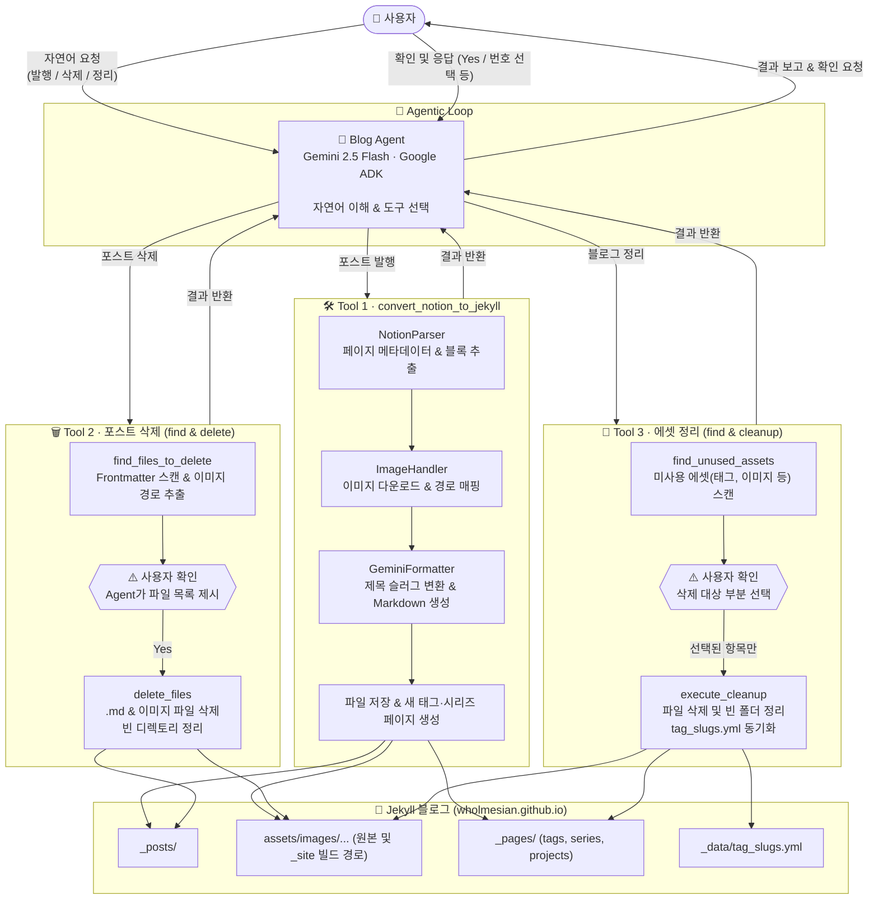

# blog-agent
wholmesian.github.io 관리를 돕는 Agentic AI 도구

## 🛠 구현된 도구 (Implemented Tools)

현재 `blog_manager` 에이전트에는 블로그 관리를 자동화하기 위한 세 가지 핵심 도구가 구현되어 있습니다.

### 1. Notion to Jekyll 변환 도구 (`convert_notion_to_jekyll`)
- **기능**: 사용자가 제공한 Notion 페이지 ID 또는 URL을 기반으로 페이지 내용을 파싱하고, Jekyll 블로그용 Markdown 포스트로 변환합니다.
- **특징**:
  - 노션 본문 블록 및 메타데이터 추출
  - 본문 내 이미지를 다운로드하여 로컬 및 웹루트 경로로 자동 매핑
  - Gemini API를 활용하여 제목을 영어 Slug로 변환 및 프론트매터 자동 생성
  - 포스트에 포함된 새로운 태그(Tag) 및 시리즈(Series) 페이지 자동 생성

### 2. 블로그 포스트 검색 도구 (`find_files_to_delete`)
- **기능**: 삭제하고자 하는 블로그 포스트의 제목(title)을 입력받아, 해당하는 마크다운 파일과 해당 포스트에서 사용된 이미지 파일들을 탐색합니다.
- **특징**:
  - 사용자의 실수로 인한 삭제를 방지하기 위한 2단계 삭제 프로세스의 첫 번째 단계
  - Frontmatter를 분석하여 정확한 포스트를 찾고, 본문 내에서 로컬 이미지 참조를 추출

### 3. 블로그 포스트 삭제 도구 (`delete_files`)
- **기능**: `find_files_to_delete` 도구가 반환한 파일 목록을 실제로 파일 시스템에서 삭제합니다.
- **특징**:
  - 사용자로부터 명시적인 확인(Confirmation)을 받은 후에만 실행
  - 마크다운 파일 및 이미지 파일을 삭제하며, 이미지가 삭제된 후 빈 폴더가 남으면 함께 정리

### 4. 블로그 에셋 정리 도구 (`find_unused_assets` & `execute_cleanup`)
- **기능**: 블로그 내에서 더 이상 참조되지 않는 잉여 에셋(태그, 시리즈, 프로젝트, 이미지)을 스캔하고, 사용자가 선택적으로 삭제할 수 있도록 돕습니다.
- **특징**:
  - `_posts/`의 프론트매터 및 본문을 분석하여 실제 사용 중인 에셋만 추려내어 미사용 파일 식별
  - 사용자에게 미사용 항목을 리스트업하고, 안전하게 삭제 대상을 부분 선택(partial selection) 가능
  - 태그 페이지 파일 삭제 시, `_data/tag_slugs.yml`의 매핑 정보도 자동으로 동기화하여 삭제

<br>

## ⚙️ 시스템 워크플로우 시각화


```mermaid
flowchart TD
    User(["👤 사용자"])

    subgraph AgentLoop["🔄 Agentic Loop"]
        LLM["🤖 Blog Agent\nGemini 2.5 Flash · Google ADK\n\n자연어 이해 & 도구 선택"]
    end

    subgraph T1["🛠 Tool 1 · convert_notion_to_jekyll"]
        N1["NotionParser\n페이지 메타데이터 & 블록 추출"]
        N2["ImageHandler\n이미지 다운로드 & 경로 매핑"]
        N3["GeminiFormatter\n제목 슬러그 변환 & Markdown 생성"]
        N4["파일 저장 & 새 태그·시리즈 페이지 생성"]
        N1 --> N2 --> N3 --> N4
    end

    subgraph T2["🗑 Tool 2 · 포스트 삭제 (find & delete)"]
        D1["find_files_to_delete\nFrontmatter 스캔 & 이미지 경로 추출"]
        D2{{"⚠️ 사용자 확인\nAgent가 파일 목록 제시"}}
        D3["delete_files\n.md & 이미지 파일 삭제\n빈 디렉토리 정리"]
        D1 --> D2 -->|"Yes"| D3
    end

    subgraph T3["🧹 Tool 3 · 에셋 정리 (find & cleanup)"]
        C1["find_unused_assets\n미사용 에셋(태그, 이미지 등) 스캔"]
        C2{{"⚠️ 사용자 확인\n삭제 대상 부분 선택"}}
        C3["execute_cleanup\n파일 삭제 및 빈 폴더 정리\ntag_slugs.yml 동기화"]
        C1 --> C2 -->|"선택된 항목만"| C3
    end

    subgraph Jekyll["📁 Jekyll 블로그 (wholmesian.github.io)"]
        J1["_posts/"]
        J2["assets/images/... (원본 및 _site 빌드 경로)"]
        J3["_pages/ (tags, series, projects)"]
        J4["_data/tag_slugs.yml"]
    end

    User -->|"자연어 요청\n(발행 / 삭제 / 정리)"| LLM
    LLM -->|"포스트 발행"| T1
    LLM -->|"포스트 삭제"| T2
    LLM -->|"블로그 정리"| T3
    
    N4 --> J1
    N4 --> J2
    N4 --> J3
    
    D3 --> J1
    D3 --> J2
    
    C3 --> J2
    C3 --> J3
    C3 --> J4
    
    T1 -->|"결과 반환"| LLM
    T2 -->|"결과 반환"| LLM
    T3 -->|"결과 반환"| LLM
    
    LLM -->|"결과 보고 & 확인 요청"| User
    User -->|"확인 및 응답 (Yes / 번호 선택 등)"| LLM
```

## 🚀 사용 방법 (How to Use)

Google Agent Development Kit (ADK) CLI를 사용하여 에이전트를 실행할 수 있습니다.

1. `blog-agent` 디렉토리로 이동하여 가상 환경을 활성화합니다.
   ```bash
   source venv/bin/activate
   ```
2. **CLI 환경에서 실행하기**
   `adk run` 명령어를 통해 터미널에서 챗봇 프롬프트를 실행합니다.
   ```bash
   adk run blog_manager/agent.py
   ```

3. **Web UI 환경에서 실행하기**
   ADK에서 제공하는 Web UI 서버를 띄워 브라우저에서 직관적으로 사용할 수 있습니다.
   ```bash
   adk web .
   ```
   *(터미널에 출력되는 `http://localhost:8080` 등의 로컬 주소로 접속하세요)*

4. 실행된 프롬프트 또는 웹 브라우저에서 자연어로 자유롭게 요청합니다.
   - *"이 노션 페이지를 블로그로 만들어줘: [Notion URL]"*
   - *"[포스트 제목] 포스트랑 관련 이미지들 다 지워줄래?"*
   - *"블로그 정리 도구를 실행해서 안 쓰는 태그나 이미지를 지워줘"*

<br>

## 🔌 MCP 서버로 사용하기 (Google Antigravity / Claude Desktop)

ADK CLI(`adk run` / `adk web`) 외에, 동일한 5개 도구(`convert_notion_to_jekyll`,
`find_files_to_delete`, `delete_files`, `find_unused_assets`, `execute_cleanup`)를
[Model Context Protocol(MCP)](https://modelcontextprotocol.io) 서버로도 노출합니다.
이 방식으로 **Google Antigravity**나 **Claude Desktop**(혹은 다른 MCP 호환 클라이언트)에서
동일한 blog-agent를 그대로 사용할 수 있습니다.

두 흐름은 서로 독립적입니다 — `agent.py`(ADK)는 그대로 두었고, `mcp_server.py`가
같은 도구 함수들을 재사용해서 MCP 프로토콜로만 감싼 것입니다.

### 1. 준비

```bash
cd blog-agent
python3 -m venv venv
source venv/bin/activate
pip install -r requirements.txt   # mcp[cli] 포함
cp .env.sample .env               # NOTION_API_KEY / GEMINI_API_KEY 입력
```

MCP 서버는 시작할 때 자동으로 저장소 루트로 작업 디렉토리를 옮기고 `.env`를
직접 읽어오기 때문에, 어떤 앱이 어떤 경로에서 프로세스를 띄우든
`config.yaml`이나 `../wholmesian.github.io/...` 같은 기존 상대 경로 로직이
그대로 동작합니다.

### 2. 동작 확인 (선택)

```bash
python -m blog_manager.mcp_server
```
정상적으로 실행되면 터미널이 멈춘 채로 대기합니다(stdio로 MCP 클라이언트의
연결을 기다리는 정상 상태입니다). `Ctrl+C`로 종료하세요.

### 3. Claude Desktop에 연결하기

Claude Desktop 설정(Settings → Developer → Edit Config)에서 여는 설정 파일에
`mcp-configs/claude_desktop_config.example.json`의 `blog-agent` 항목을
합쳐 넣고, 경로를 실제 절대 경로로 바꾼 뒤 Claude Desktop을 재시작하세요.

- macOS: `~/Library/Application Support/Claude/claude_desktop_config.json`
- Windows: `%APPDATA%\Claude\claude_desktop_config.json`

```json
{
  "mcpServers": {
    "blog-agent": {
      "command": "/ABSOLUTE/PATH/TO/blog-agent/venv/bin/python3",
      "args": ["-m", "blog_manager.mcp_server"],
      "cwd": "/ABSOLUTE/PATH/TO/blog-agent"
    }
  }
}
```

### 4. Google Antigravity에 연결하기

`mcp-configs/antigravity_mcp_config.example.json`의 내용을 경로만 바꿔서
아래 위치 중 하나에 저장한 뒤, Antigravity에서 MCP 서버 목록을 새로고침하세요.

- 전역: `~/.gemini/config/mcp_config.json`
- 이 프로젝트에만 적용: `.agents/mcp_config.json`

### 5. 참고 사항

- 두 클라이언트 모두 도구를 실제로 실행하기 전에 사용자 확인을 요청하는
  UI를 갖고 있어서, `delete_files` / `execute_cleanup`처럼 파일을 지우는
  도구도 기존 ADK 버전과 동일하게 "먼저 찾고 확인받은 뒤 삭제" 흐름을
  유지할 수 있습니다. MCP 서버의 `instructions`에도 이 흐름을 명시해
  두었습니다.
- Notion/Gemini API 키는 `.env`에서 읽어오므로, Claude Desktop이나
  Antigravity의 설정 파일에 별도로 `env` 값을 넣지 않아도 됩니다. 원한다면
  `env` 필드로 덮어쓸 수도 있습니다.
